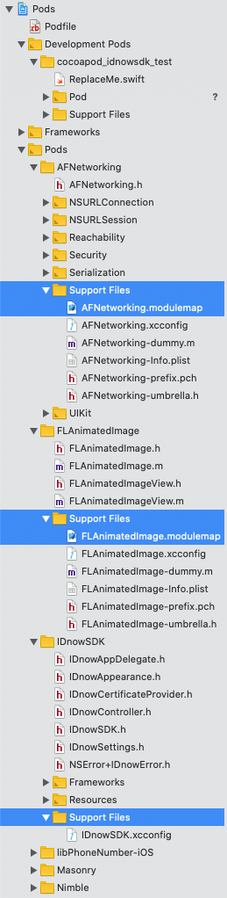

# Using IDnowSDK in a Cocoapod (repo of a bug)

We're trying to use the [IDnow iOS SDK](https://github.com/idnow/de.idnow.ios) in our Flutter project. But the IDnowSDK module can not be imported - no matter what we try to do.

This repo is the easiest representation of the bug we could came up with, and does not use Flutter - just Cocoapods.

## Issue description

- Created a new cocoapod library using `pod lib create cocoapod_idnowsdk_test`
- We added `IDnowSDK` and `AFNetworking` (for reference) in our podspec file: [cocoapod_idnowsdk_test.podspec#L41-L43](cocoapod_idnowsdk_test.podspec#L41-L43)
- Also we had to add them to the Podfile as well: [Example/Podfile#L7-L8](Example/Podfile#L7-L8)
- Then we ran a `pod install` in the `Example` folder
- In `ReplaceMe.swift` of the library, we added imports for both `AFNetworking` and `IDnowSDK`: [ReplaceMe.swift#L2](cocoapod_idnowsdk_test/Classes/ReplaceMe.swift#L2)
- AFNetworking module can be found, but IDnowSDK can't (**fails with `No such module 'IDnowSDK'`**)

The issue seems to be that the IDnowSDK does not generate a modulemap file like all the other Pods. When we show the Pods in Xcode, it looks like this:

We actually tracked the bug as [Flutter issue 48503](https://github.com/flutter/flutter/issues/48503) first, but came to the same finding - that the issue is not related to Flutter. And that a missing `.modulemap` file seems to be the issue.
